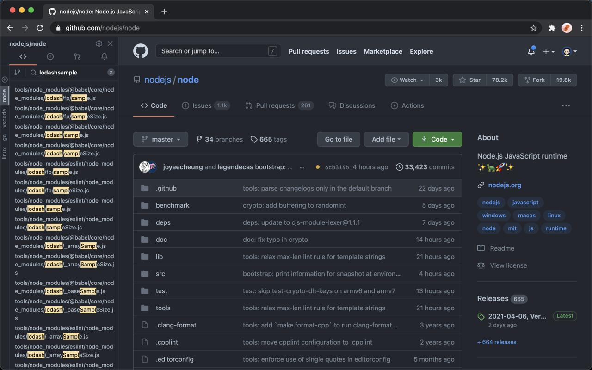

# OneSidebar - The missing navigator of GitHub

OneSidebar is a browser extension for navigating GitHub. It adds a sidebar to let you
navigate GitHub files, issues, pull requests, and notifications quickly on the
same browser window.

No longer having to open too many tabs! Your files, issues, and notifications
are only a single click away!

## Get the extension

| Firefox| Chrome| Edge|
|:---:|:---:|:---:|
| &nbsp;&nbsp;&nbsp;&nbsp;&nbsp;&nbsp; [Download](https://onesidebar.com/f) &nbsp;&nbsp;&nbsp;&nbsp;&nbsp; | &nbsp;&nbsp;&nbsp;&nbsp;&nbsp; [Download](https://onesidebar.com/c) &nbsp;&nbsp;&nbsp;&nbsp;&nbsp; | &nbsp;&nbsp;&nbsp;&nbsp;&nbsp; [Download](https://onesidebar.com/e) &nbsp;&nbsp;&nbsp;&nbsp;&nbsp;&nbsp; |

## About

- Website: [onesidebar.com](https://onesidebar.com) | [twitter.com/onesidebar](https://twitter.com/onesidebar)
- Author: [Oliver](https://olvrng.github.io) | [twitter.com/_OliverN](https://twitter.com/_OliverN)
- Find me on: [My blog](https://olvrng.github.io) | [Twitter](https://twitter.com/_OliverN) | [Medium](https://olvrng.medium.com/) | [Hackernoon](https://hackernoon.com/u/olvrng)

This repository is used as a bug tracker for OneSidebar. If you have any problems or
questions or want to suggest a feature, feel free to [start a
discussion](https://github.com/onesidebar/OneSidebar/discussions) or [open a new
issue](https://github.com/onesidebar/OneSidebar/issues).

## Screenshots

### 1. File Tree

### 2. Issues

### 3. Notifications

### 4. Fuzzy search

### 5. Light & Dark Themes

## About your data

I have no interest in your data at all. As developers, we all respect privacy
and data. So no tracking code. No Google Analytics. Nothing is sent out of your
browser.

When you log in for more advanced features, only your GitHub username is used
for checking the license.

## This repository

This repository is used as a bug tracker for OneSidebar. If you have any problems or
questions or want to suggest a feature, feel free to [start a
discussion](https://github.com/onesidebar/OneSidebar/discussions) or [open a new
issue](https://github.com/onesidebar/OneSidebar/issues).

Hope you enjoy the extension!
 －[Oliver](https://twitter.com/_OliverN)
